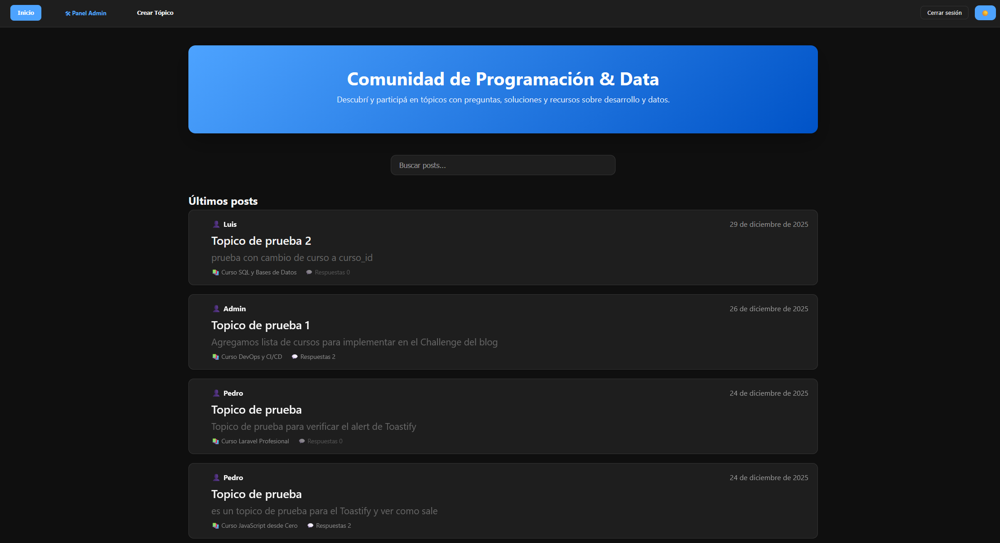
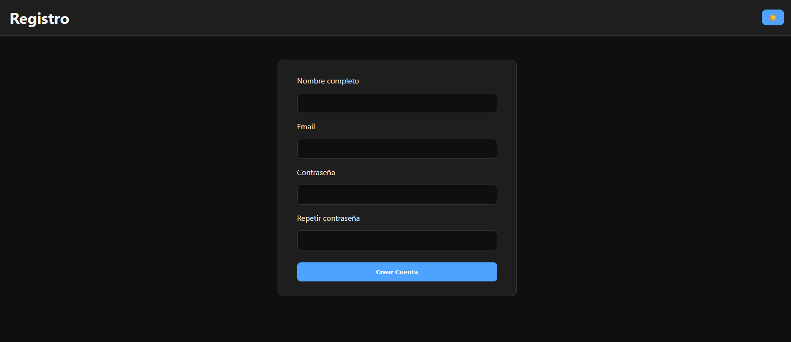
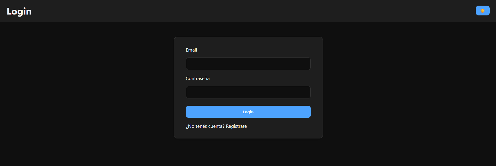
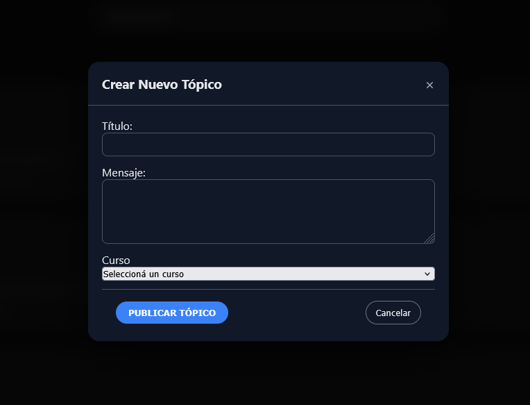
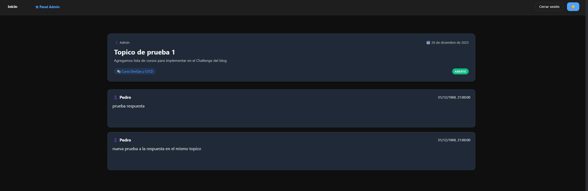
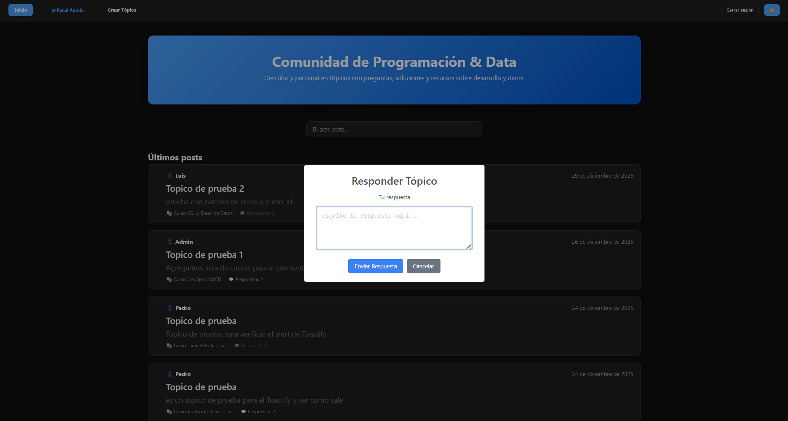
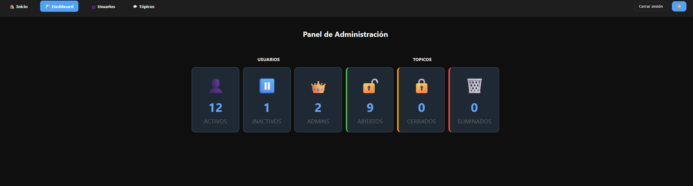
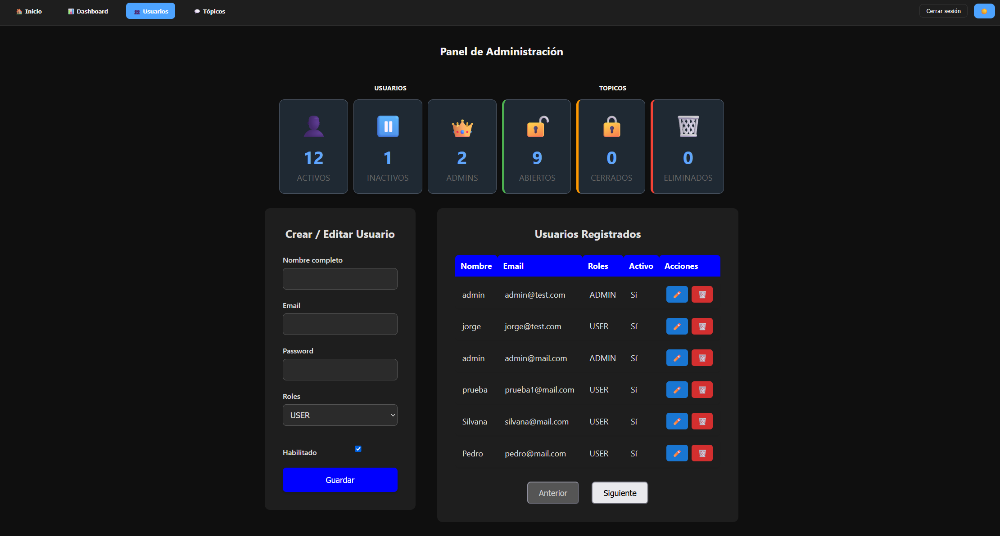
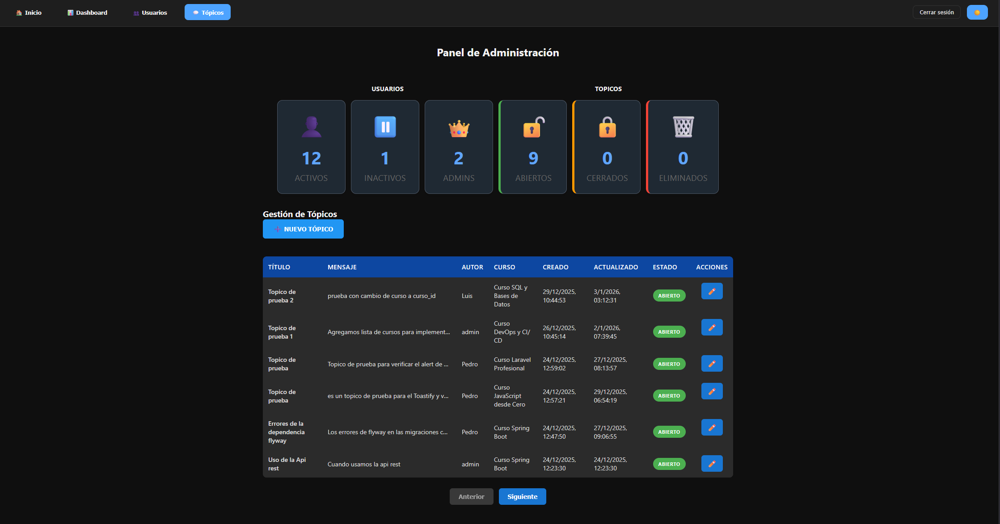

# 📝 Alura Blog / Foro - API REST + Frontend


## Proyecto desarrollado como parte del Challenge Alura Latam, que implementa un foro completo con autenticación, roles, tópicos, respuestas anidadas y panel de administración, utilizando Spring Boot en el backend y HTML/CSS/JS en el frontend.

# 🚀 Tecnologías utilizadas

## Backend

Java 21

Spring Boot 3

Spring Security

JWT (Auth0)

Spring Data JPA (Hibernate)

MySQL

Flyway

Lombok

Maven

Swagger / OpenAPI

## Frontend

HTML5

CSS3 (custom, diseño tipo card)

JavaScript (Vanilla)

Fetch API

SweetAlert2

Toastify

Dark / Light mode

# 🧱 Arquitectura

API REST desacoplada

Autenticación stateless con JWT

Roles de usuario:

USER

ADMIN

## Separación por capas:

Controller

Service

Repository

Security

Domain

Frontend independiente consumiendo la API vía HTTP

# 🔐 Autenticación y Seguridad

La API utiliza JWT (JSON Web Token) para proteger los endpoints.

Flujo de autenticación

Registro de usuario (/auth/register)

Login (/auth/login)

El backend devuelve un JWT

El frontend guarda el token en localStorage

El token se envía en cada request protegida:

```html
Authorization: Bearer <token>
```

# 📌 Endpoints principales

## 🔑 Autenticación

## Registro de usuario

```html
POST /auth/register

{
  "fullName": "Juan Pérez",
  "email": "juan@email.com",
  "password": "123456"
}

```

### 📌 Respuesta:

```html
201 Created
```

## Login

```html
POST /auth/login

{
  "email": "juan@email.com",
  "password": "123456"
}

```

## 📌 Respuesta:

```html
{
  "token": "eyJhbGciOiJIUzI1NiIsInR5cCI6IkpXVCJ9..."
}
```

## 🧵 Tópicos y Respuestas (Foro)

### 📝 Tópicos

| Método | Endpoint      | Descripción         |
| ------ | ------------- | ------------------- |
| GET    | /topicos      | Listar tópicos      |
| GET    | /topicos/{id} | Ver tópico          |
| POST   | /topicos      | Crear tópico        |
| PUT    | /topicos/{id} | Editar (solo autor) |
| PUT    | /topicos/{id} | Cerrar tópico       |

## 💬 Respuestas

| Método | Endpoint                                          |
| ------ | ------------------------------------------------- |
| GET    | /topicos/{id}/respuestas                          |
| POST   | /topicos/{id}/respuestas                          |
| POST   | /topicos/{id}/respuestas/{respuestaId}/respuestas |

✔ Respuestas anidadas
✔ Solución aceptada
✔ Edición y eliminación solo por el autor

## 🛠️ Panel de Administración

El rol ADMIN accede a un panel separado desde el frontend.

Funciones del admin:

Gestión de usuarios

Gestión de tópicos

Moderación general

### 📌 El admin NO edita ni cierra tópicos desde la vista pública, manteniendo reglas claras de negocio.

## 🗄️ Base de Datos

MySQL 8

Migraciones gestionadas con Flyway

Tablas principales:

users

user_roles

posteos

flyway_schema_history

## ⚙️ Configuración
application.properties

```java
server.port=Tu_port

spring.datasource.url=jdbc:mysql://localhost:3306/alura_blog_api
spring.datasource.username=Tu_Usuario
spring.datasource.password=Tu_Contraseña

spring.jpa.show-sql=true
spring.jpa.hibernate.ddl-auto=update

api.security.token.secret=Tu_Token_secreto

```

## 🧪 Pruebas

Las pruebas de la API pueden realizarse con:

Insomnia

Postman

Swagger UI

Swagger disponible en:

```html

http://localhost:8081/swagger-ui.html

```

## 🌐 Frontend

Vista Home con listado de tópicos

Vista Detalle de Tópico consistente con el index

Cards reutilizables

Acciones visibles solo al hacer hover (desktop)

Responsive

Modo oscuro

Feedback visual con toasts y modales

## 🖼️ Capturas del proyecto

📂 Las imágenes se guardan en:

/docs/images/













## 🎓 Certificado – Alura

Proyecto desarrollado dentro del programa Oracle Next Education – Alura Latam.

## 🗄️ Base de Datos

MySQL 8

Migraciones con Flyway

Tablas principales:

users

user_roles

topicos

respuestas

flyway_schema_history

## ⚙️ Configuración

application.properties

```java
server.port=8081

spring.datasource.url=jdbc:mysql://localhost:3306/alura_blog_api
spring.datasource.username=TU_USUARIO
spring.datasource.password=TU_PASSWORD

spring.jpa.show-sql=true
spring.jpa.hibernate.ddl-auto=update

api.security.token.secret=TU_SECRETO_JWT

```

## 🧪 Pruebas

Postman

Insomnia

Swagger UI

Swagger disponible en:

```html

http://localhost:8081/swagger-ui.html

```

## 🧠 Aprendizajes destacados

JWT y seguridad stateless

Control de permisos por rol y autoría

Respuestas anidadas

Separación frontend / backend

UX basada en reglas reales

Diseño consistente y mantenible

## 👨‍💻 Autor

Jorge Gustavo Martinez
Analista Programador – Backend / Fullstack Developer

Proyecto realizado para Alura Latam – Java & Spring Boot

## 📄 Licencia

Proyecto de uso educativo.
